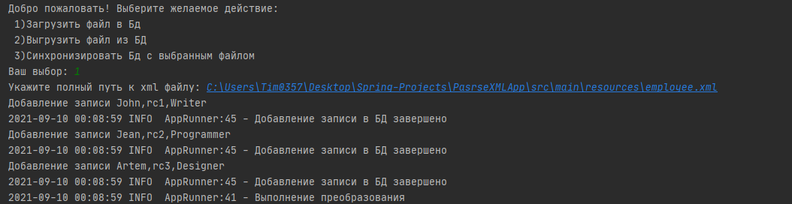
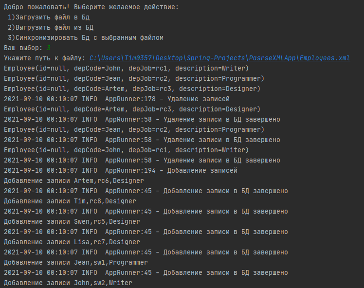

# XmlAp
### Основной стек технологий:  
- Spring JDBC
- Spring Boot
- MariaDB
- Lombok  
### Основной функционал программы:  
- Загрузка xml-файла с последующим парсингом и добавлением в БД
- Выгрузка из данных из БД и преобразование в xml-файл
- Синхронизация БД с xml-файлом
- Выгрузка\Загрузка одного и того же файла происходит корректно

### Загрузка xml-файла

### Сихронизация БД с xml-файлом

### Запуск:  
1.Создайте базу данных с данной таблицей:
~~~~ 
CREATE TABLE employee(
 id BIGINT PRIMARY KEY AUTO_INCREMENT,
 depCode VARCHAR(20) UNIQUE NOT NULL,
 depJob VARCHAR(100) UNIQUE NOT NULL,
 description VARCHAR(255) NOT NULL
); 
~~~~
2.Скачайте или клонируйте данный проект `https://github.com/ScionRs/XmlApp.git`  
3.В параметрах `application.properties` укажите настройку подключения к вашей базе данных  
4.Запустить с помощью комбинации клавиш Shift + F10  
